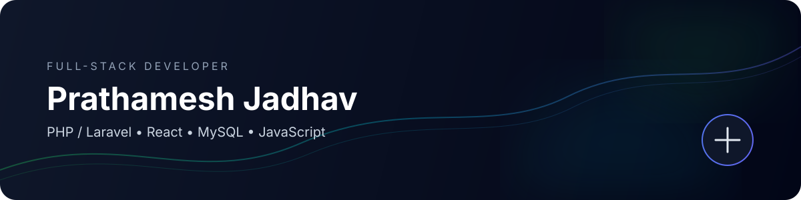

 

 

> **I build software that solves an actual problem — from database and backend logic to the interface people use.**

I'm a full-stack developer focused on **PHP/Laravel, React, JavaScript and MySQL**, currently building **AI-powered developer tools** alongside practical web applications.

---

## ⚡ What I'm Working On

### 01 — JobScout AI

**AI-powered job discovery + resume optimization**

A multi-source job aggregation system that collects developer roles, deduplicates listings, scores relevance against a candidate profile, and uses Gemini to tailor resumes for specific JDs.

**Python** · **Gemini** · **SQLite** · **JobSpy** · **Streamlit** · **Automation**

**→ [Explore JobScout AI](https://github.com/PrathameshDev2803/jobscout-ai)**

---

## 🧱 Selected Work

<table>
<tr>
<td width="50%">

### 📝 NoteStack

Rich-text note application built around **React + Tiptap**.

- Rich text & formatting
- Image embedding
- Audio support
- Client-side persistence
- React Router

**Stack:** React · JavaScript · Tiptap

**→ [View repository](https://github.com/PrathameshDev2803/notestack)**

</td>
<td width="50%">

### 💬 Traction Ideas

Product feedback platform built with **PHP + MySQL**.

- Authentication & sessions
- Suggestions & voting
- Comments
- Live search
- AJAX workflows
- Role-aware actions

**Stack:** PHP · MySQL · Bootstrap

**→ [View repository](https://github.com/PrathameshDev2803/traction-ideas-feedback-wall)**

</td>
</tr>
<tr>
<td width="50%">

### 💰 Expense Tracker

Database-driven expense management application.

- CRUD workflows
- Categorization
- Persistent MySQL data
- Server-side processing
- Responsive UI

**Stack:** PHP · MySQL · JavaScript

**→ [View repository](https://github.com/PrathameshDev2803/Expense-Tracker)**

</td>
<td width="50%">

### 🏥 Production Work

Worked on a real-world pain management website with a focus on **responsive UX, accessibility and SEO**.

Areas I care about:

- WCAG-aware interfaces
- Responsive layouts
- Content systems
- SEO & Search Console
- Production polish

</td>
</tr>
</table>

---

## 🛠️ My Stack

### Frontend

### Backend & Data

### Tools

---

## 🧠 Engineering Interests

~~~text
PRODUCT THINKING
      ↓
  Architecture
      ↓
Backend + Database
      ↓
Frontend + UX
      ↓
Testing / Debugging
      ↓
Deployment
~~~

I'm particularly interested in **full-stack product development**, backend architecture, developer tooling, automation and AI-assisted workflows.

---

## 📍 Currently Learning

- Laravel architecture & production patterns
- Advanced React
- API design
- Deployment & production workflows
- AI-powered developer tools

---

## 🎯 What I'm Looking For

**Junior / Entry-Level Full-Stack Developer**  
**PHP / Laravel Developer**

I'm looking for a team where I can contribute to real products, work across the stack, learn from experienced engineers and gradually take ownership of features.

---

### Let's build something useful.

<a href="mailto:prathameshjadhav0208@gmail.com">Email</a>
&nbsp; · &nbsp;
<a href="https://github.com/PrathameshDev2803">GitHub</a>

  

Built with curiosity, caffeine & a lot of debugging.

